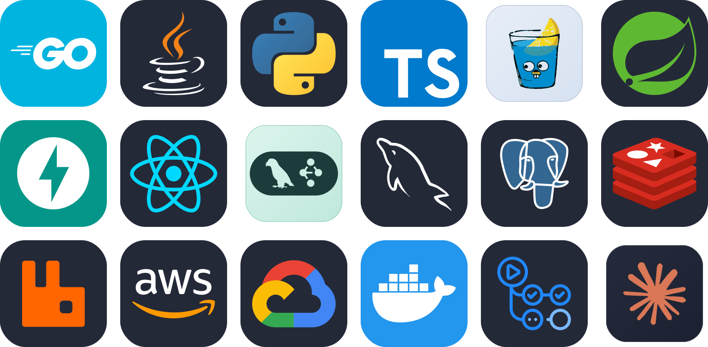

  <!-- Dynamic Header Banner - Tech Slice Style -->
  

     
     
     
    
    

  

  
  &nbsp;&nbsp;&nbsp;&nbsp;&nbsp;&nbsp;&nbsp;&nbsp;&nbsp;&nbsp;
  

  <!-- Twinkling Waving Footer -->
  

