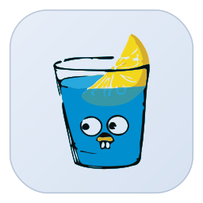
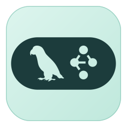

  <!-- Dynamic Header Banner - Tech Slice Style -->
  

     
     
     
    
    
    

 Thanks for visiting my GitHub profile!

<table>
  <tr>
    <td width="50%" align="left">
      <table cellpadding="4" cellspacing="0">
        <tr>
          <td></td>
          <td></td>
          <td></td>
          <td></td>
          <td></td>
          <td></td>
        </tr>
        <tr>
          <td></td>
          <td></td>
          <td></td>
          <td></td>
          <td></td>
          <td></td>
        </tr>
        <tr>
          <td></td>
          <td></td>
          <td></td>
          <td></td>
          <td></td>
          <td></td>
        </tr>
        <tr>
          <td></td>
        </tr>
      </table>
    </td>
    <td width="38%" align="center">
      
    </td>
  </tr>
</table>

  <!-- Twinkling Waving Footer -->
  

